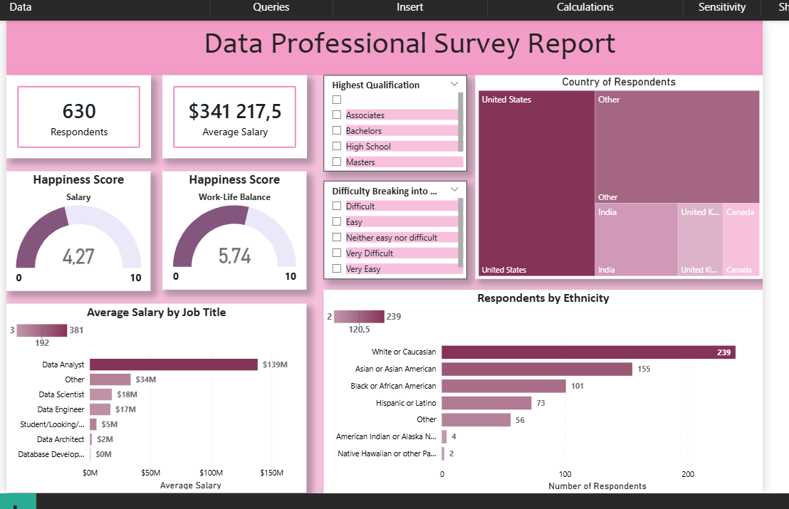
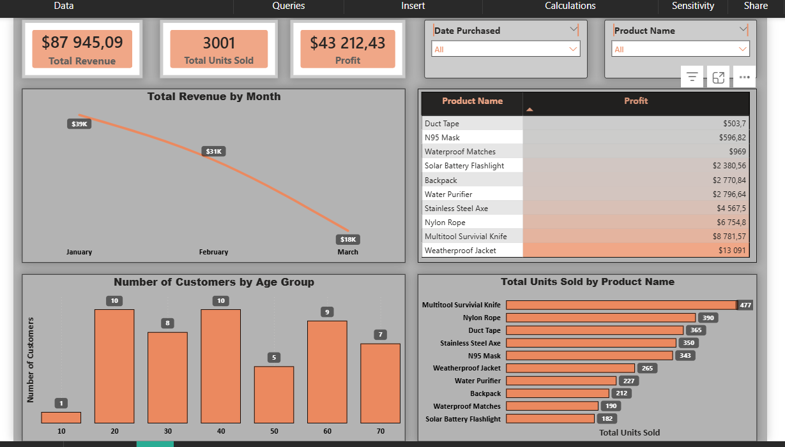

# Data Analysis Portfolio

## 1. Data Professional Survey Report (Power BI)
This dashboard analyzes global trends among data professionals, including salary distributions and workplace happiness.

## 2. Pizza Sales Performance Dashboard (Excel)
A comprehensive look at operational data, visualizing hourly sales trends and product category performance.

